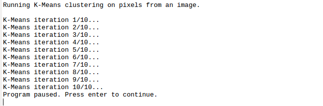

# KMeans-Compressor

##Repository to contain the code for compressing image files using KMeans Clustering

We find the the 16 dominant colors in the image and try to represent the original image using just these 16 colors !!

To use ::
+ Clone the repo
+ Install MATLAB/Octave
+ Place your image in the directory
+ Change the input file name in the compressor.m file
+ run the following command ::  **compressor**

Here is a screenshot of the process 

---
---
---

Example Input ::

Example Output ::

##And thats almost 6 times resuction in size !!